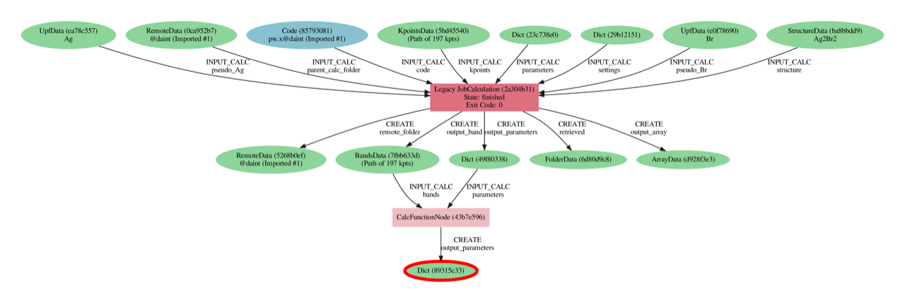

.. _stories:browse_export:

***************************
Browsing a curated database
***************************

A common source of problems for new users of AiiDA often arises when they receive an exported database and want to get an idea of its content but don't know how.

In the following section we will use the database from "Two-dimensional materials from high-throughput computational exfoliation of experimentally known compounds" to show some examples of useful queries that can help with this.
This will hopefully give you some guidance on how to apply and extend queries for your needs

Using the discover section
..........................

In the case of this particular database, an easy to explore interface is available through the `specific Discover section <https://www.materialscloud.org/discover/2dstructures/dashboard/ptable>`_ of the Materials Cloud.
This interface will provide a general overview of all materials available, and choosing any of them (let's say, `silver bromide <https://www.materialscloud.org/discover/2dstructures/details/AgBr>`_) will give you access to of its available calculated properties.
If one was interested in, say, the band structure properties, one could use the explore button next to the `Band gap [eV]: 1.3` to go to the `actual node <https://www.materialscloud.org/explore/2dstructures/details/89315c33-2f9b-41ab-b7d4-22aff0ae75f4?nodeType=NODE>`_ that contains this information.

For our purposes now we will just take note of the UUID of this node and see how to check the information in a local database.
We invite the reader to browse the discovery and explore sections for this database on their own to get an idea of the features offered by the Materials Cloud interface.

Setting up the work environment
...............................

If you already have an AiiDA setup you want to use to follow this instructions, all you need to do is download the 2D database from `its archive entry <https://archive.materialscloud.org/record/2017.0008/v3/>`_ (or `here <https://archive.materialscloud.org/record/file?file_id=d1f3ac29-e3b0-400b-8109-8455be66160b&filename=two_dimensional_database.aiida&record_id=18>`_ is a direct download link) and run ``verdi import <filename>``.
We would anyways recommend that you create a new profile (see instructions below) so that the data does not get mixed up with the one from your production environment.

If you don't already have AiiDA installed or you prefer to use a more conteinerized environment, you can download the `Quantum Mobile <https://www.materialscloud.org/work/quantum-mobile>`_, which is an already setted up virtual machine.
You can click on the download button and follow the instructions in the github releases section.
To get the database into your virtual machine by either setting up a `shared folder <https://www.virtualbox.org/manual/UserManual.html#sharedfolders>`_ or by directly downloading the file there by running:

.. code-block:: bash

    wget 'https://archive.materialscloud.org/record/file?file_id=d1f3ac29-e3b0-400b-8109-8455be66160b&filename=two_dimensional_database.aiida&record_id=18' -O two_dimensional_database.aiida

Once you have your virtual machine up and running and before importing the database, you will need to set up a user profile.
We will do so by running the ``quicksetup`` command, and AiiDA will automatically create the new clean database to be used by it.
In the case below we chose to name the profile `querytest`, but you can use whatever name you prefer (just be consistent afterwards).
If you have not done so already, make sure you have loaded the correct working environment before going on with this procedure (see the first command line below).

.. code-block:: bash

    max@qmobile:~$ workon aiida
    (aiida) max@qmobile:~$ verdi quicksetup 
        Info: enter "?" for help
        Info: enter "!" to ignore the default and set no value
        Profile name [quicksetup]: querytest
        User email [aiida@localhost]: 
        First name [Max]: 
        Last name [Scientist]: 
        Institution [Quantum Mobile]: 
        Warning: Found host 'localhost' but dropping '-h localhost' option for psql since this may cause psql to switch to password-based authentication.
        Success: created new profile `querytest`.
        Info: migrating the database.
        Operations to perform:
            Apply all migrations: auth, contenttypes, db
        Running migrations:
            Applying contenttypes.0001_initial... OK
            Applying contenttypes.0002_remove_content_type_name... OK
            Applying auth.0001_initial... OK
            Applying auth.0002_alter_permission_name_max_length... OK
            Applying auth.0003_alter_user_email_max_length... OK
            (...)
            Applying db.0042_prepare_schema_reset... OK
            Applying db.0043_default_link_label... OK
        Success: database migration completed.
    (aiida) max@qmobile:~$ 

Now switch from your current profile to this newly created one by using ``verdi profile setdefault querytest``, import the 2D materials database with ``verdi import two_dimensional_database.aiida``, and now we are ready to begin.

Manually browsing the database
..............................

Now that we have a local instance of this database, we can see how to get some information regarding our node of interest (identified previously as the one that contains the band gap energy of AgBr).
For this we will use the AiiDA interactive shell:

.. code-block:: bash

    (aiida) max@qmobile:~$ verdi shell

Now we will do some manual querying to explore this node properties and connections.

1. Load the node by using its UUID:

.. code-block:: Python

    In [1]: bandgap_node = load_node('89315c33-2f9b-41ab-b7d4-22aff0ae75f4')
    In [2]: bandgap_node
    Out[2]: <Dict: uuid: 89315c33-2f9b-41ab-b7d4-22aff0ae75f4 (pk: 4625)>

2. One can check the attributes and discover the band gap is in eV and is stored in the attribute named ‘band_gap’ (knowing that the parser always returns eV, we are not going to use the units in the following, but one could generalise the query later if it was necessary).

.. code-block:: Python

    In [3]: bandgap_node.attributes
    Out[3]: {'band_gap': 1.25790023795923, 'band_gap_units': 'eV', 'is_insulator': True}

3. We start inspecting the provenance using .creator to get the calculation that generated the data node:

.. code-block:: Python

    In [4]: calculation_node = bandgap_node.creator
    In [5]: calculation_node
    Out[5]: <CalcFunctionNode: uuid: 43b7e596-130c-4733-b3dd-13b264b845a0 (pk: 3028)>

4. Then we can use .inputs.LABEL_NAME to access any of the inputs of this calculation. In our case, we will be interested in the one labeled “bands” (note that there is tab completion after .inputs.<TAB>):

.. code-block:: Python

    In [6]: bands_node = calculation_node.inputs.bands_node
    In [7]: bands_node
    Out[7]: <BandsData: uuid: 7fbb633d-a224-46b7-84b1-74a3ceca81e0 (pk: 4689)>

5. In the same way we did before, we can now check the calculation that created this BandsData node (band structure), and see it was a Quantum ESPRESSO run:

.. code-block:: Python

    In [8]: qecalc_node = bands_node.creator                                          
    In [9]: qecalc_node                                          
    Out[9]: <CalcJobNode: uuid: 2a304b31-5a60-4884-bfe7-3c0b1d2c67fc (pk: 57863) (aiida.calculations:quantumespresso.pw)>

6. Finally, we can check another input one level up to find the original crystal structure:

.. code-block:: Python

    In [10]: qecalc_node.inputs.structure                         
    Out[10]: <StructureData: uuid: ba8bbdd9-defc-4292-af7d-ed3eb73f778e (pk: 53436)>

Note that we don't really need all of the intermediate node variables, as all of these steps can just be concatenated in a single chain of propery accessess from our originally identified ``bandgap_node``.
In the end, we wil arrive at the exact same structure node:

.. code-block:: Python

    In [11]: bandgap_node.creator.inputs.bands.creator.inputs.structure                         
    Out[11]: <StructureData: uuid: ba8bbdd9-defc-4292-af7d-ed3eb73f778e (pk: 53436)>

One more one might want to do is to check if there is a better way to distinguish the CalcFunctionNode that I got at Out[5] above (stored in ``calculation_node = bandgap_node.creator``).
Let’s check its attributes:

.. code-block:: Python

    In [12]: bandgap_node.creator.attributes.keys()                                             
    Out[12]: dict_keys(['function_name', 'sealed', 'first_line_source_code', 'namespace', 'source_code', 'source_file'])
    In [13]: bandgap_node.creator.attributes['function_name']                                   
    Out[13]: 'get_bandgap_inline'

This information will be useful in the following section, and will basically allow to filter by the function name.

Now after all of this we have a better understanding of the the structure of the data.
Another useful tool to get a good idea of the connectivity is the graph generator.
One can use `verdi node graph generate` to visualize the provenance surrounding a node (limiting it to 4 levels up(will be enough for this case).
Not that this has to be executed outside of the verdi shell.

.. code-block:: bash

    (aiida) max@qmobile:~$ verdi node graph generate --process-in --process-out --ancestor-depth=4 --descendant-depth=0 89315c33

The result should look something like this:

Systematic querying of the database
...................................

Let’s now construct the query using the QueryBuilder.
Create a new text file and copy the content below (these are essentially python scripts, so you can use the `.py` extension).
There are some comments which explain the purpose of each of the lines of code.

.. code-block:: Python

    from aiida.orm 
    import QueryBuilder, Dict, CalculationNode, BandsData, StructureData
    
    # Create a new query builder object
    query = QueryBuilder()
    
    # I want, in the end, the 'band_gap' property returned ("projected")
    # This is in the attributes of the Dict node
    # I also want to filter them and get only those where the band gap (in eV) is < 0.5
    query.append(Dict, project=['attributes.band_gap'],
    filters={'attributes.band_gap': {'<':0.5}}, 
    tag='bandgap_node')
    
    # This has to be generated by a CalculationNode (it's a super class of CalcFunctionNode,
    # one could write CalcFunctionNode as well), and I only want those where the
    # function name stored in the attributes is 'get_bandgap_inline'
    query.append(
        CalculationNode, 
        filters={'attributes.function_name': 'get_bandgap_inline'}, 
        with_outgoing='bandgap_node',
        tag='bandgap_calc',
    )
    
    # One of the inputs should be a BandsData (band structure node in AiiDA)
    query.append(BandsData, with_outgoing='bandgap_calc', tag='band_structure')
    
    # This should have been computed by a calculation (we know it's Quantum ESPRESSO
    # in this DB so I don't add more specific filters)
    query.append(CalculationNode, with_outgoing='band_structure', tag='qe')
    
    # I want to get back the input crystal structure, and I want to get back
    # the AiiDA node (indicated with '*')
    query.append(StructureData, with_outgoing='qe', project='*')
    
    # I have decided to project on two things: the band_gap and the structure node
    for band_gap, structure in query.all():
        print("Band gap for {}: {:.3f} eV".format(structure.get_formula(), band_gap))

With these 8 lines of code (removing the comments and the import line) one is able to perform a query that will return all the structures (and band gaps) that are below a 0.5 eV treshold.
You can execute the script by running ``verdi run <script_name>``.
Here is the output you should obtain if you only have the 2D materials database in your profile.

.. code-block:: bash

    Band gap for I4Zr2: 0.416 eV
    Band gap for Br2Nd2O2: 0.308 eV
    Band gap for Br2Cr2O2: 0.448 eV
    Band gap for Br4O2V2: 0.108 eV
    Band gap for Cl2La2: 0.003 eV
    Band gap for Cl2Co: 0.029 eV
    Band gap for CdClO: 0.217 eV
    Band gap for Cl2Er2S2: 0.252 eV
    Band gap for Cl4O2V2: 0.010 eV
    Band gap for CdClO: 0.251 eV
    Band gap for GeI2La2: 0.369 eV
    Band gap for Se2Zr: 0.497 eV
    Band gap for Cu4Te2: 0.207 eV
    Band gap for Br2Cr2S2: 0.441 eV
    Band gap for Co2H4O4: 0.014 eV
    Band gap for Cl2Er2S2: 0.252 eV
    Band gap for Br2Co: 0.039 eV
    Band gap for I2Ni: 0.295 eV
    Band gap for I2N2Ti2: 0.020 eV
    Band gap for Cl2Cu: 0.112 eV
    Band gap for Cl2O2Yb2: 0.006 eV
    Band gap for Cl2O2Yb2: 0.006 eV
    Band gap for Br2Co: 0.196 eV
    Band gap for C2: 0.000 eV
    Band gap for Cl2La2: 0.008 eV
    Band gap for Br2Nd2O2: 0.002 eV
    Band gap for I2O2Pr2: 0.030 eV
    Band gap for Cl2Co: 0.171 eV
    Band gap for Cl2Cu: 0.158 eV
    Band gap for Cl2Er2S2: 0.203 eV
    Band gap for Br2Cr2S2: 0.427 eV
    Band gap for S2Ti: 0.059 eV
    Band gap for Br2Cr2O2: 0.486 eV
    Band gap for I2Ni: 0.319 eV

One can also have fun adding more statements before calling `.all()`.
Here a couple of examples:

- One can check that the input code of AiiDA was a specific one:

.. code-block:: python

    query.append(Code, with_outgoing='qe', filters={'attributes.input_plugin': 'quantumespresso.pw'})

- One can project back the total running time (wall time) of the Quantum ESPRESSO calculation (it's in an output node with link label 'output_parameters'). For this one needs to add a third element to the tuple when looping over .all():

.. code-block:: python

    query.append(Dict, with_incoming='qe', edge_filters={'label':'output_parameters'}, project=['attributes.wall_time_seconds'])

    (...)

    for band_gap, structure, walltime in query.all():
        print("Band gap for {}: {:.3f} eV (walltime = {})".format(structure.get_formula(), band_gap,walltime))

Behind the scenes
-----------------

As a final comment, we strongly suggest using the QueryBuilder rather than going directly into the PSQL DB.
We’ve spent significant efforts in making the QueryBuilder interface easy to use, and taking care ourselves of converting this into the corresponding SQL.
Just for reference, if you do `print(query)` you get the corresponding SQL statement for the query above, that should translate to the following:

.. code-block:: sql

    SELECT db_dbnode_1.attributes #> '{band_gap}' AS anon_1, db_dbnode_2.uuid, db_dbnode_2.attributes, db_dbnode_2.id, db_dbnode_2.extras, db_dbnode_2.label, db_dbnode_2.mtime, db_dbnode_2.ctime, db_dbnode_2.node_type, db_dbnode_2.process_type, db_dbnode_2.description, db_dbnode_2.user_id, db_dbnode_2.dbcomputer_id
    FROM db_dbnode AS db_dbnode_1 JOIN db_dblink AS db_dblink_1 ON db_dblink_1.output_id = db_dbnode_1.id JOIN db_dbnode AS db_dbnode_3 ON db_dblink_1.input_id = db_dbnode_3.id JOIN db_dblink AS db_dblink_2 ON db_dblink_2.output_id = db_dbnode_3.id JOIN db_dbnode AS db_dbnode_4 ON db_dblink_2.input_id = db_dbnode_4.id JOIN db_dblink AS db_dblink_3 ON db_dblink_3.output_id = db_dbnode_4.id JOIN db_dbnode AS db_dbnode_5 ON db_dblink_3.input_id = db_dbnode_5.id JOIN db_dblink AS db_dblink_4 ON db_dblink_4.output_id = db_dbnode_5.id JOIN db_dbnode AS db_dbnode_2 ON db_dblink_4.input_id = db_dbnode_2.id
    WHERE CAST(db_dbnode_5.node_type AS VARCHAR) LIKE 'process.calculation.%%' AND CAST(db_dbnode_4.node_type AS VARCHAR) LIKE 'data.array.bands.%%' AND CAST(db_dbnode_2.node_type AS VARCHAR) LIKE 'data.structure.%%' AND CAST(db_dbnode_1.node_type AS VARCHAR) LIKE 'data.dict.%%' AND CASE WHEN (jsonb_typeof(db_dbnode_1.attributes #> %(attributes_1)s) = 'number') THEN CAST((db_dbnode_1.attributes #>> '{band_gap}') AS FLOAT) < 0.5 ELSE false END AND CAST(db_dbnode_3.node_type AS VARCHAR) LIKE 'process.calculation.%%' AND CASE WHEN (jsonb_typeof(db_dbnode_3.attributes #> %(attributes_2)s) = 'string') THEN (db_dbnode_3.attributes #>> '{function_name}') = 'get_bandgap_inline' ELSE false END

So unless you feel ready to tackle this, I’d rather stick with the simpler QueryBuilder interface!

1. https://aiida.readthedocs.io/projects/aiida-core/en/latest/querying/querybuilder/queryhelp.html
2. https://aiida.readthedocs.io/projects/aiida-core/en/v1.2.0/querying/querybuilder/queryhelp.html
3. https://aiida.readthedocs.io/projects/aiida-core/en/latest
4. https://github.com/aiidateam/aiida-core/wiki/Writing-documentation
5. https://aiida.readthedocs.io/projects/aiida-core/en/latest/howto/data.html#finding-and-querying-for-data
